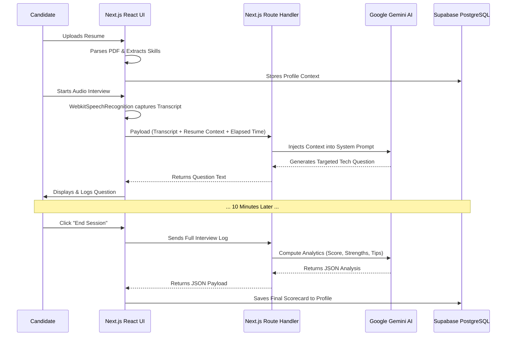

# 🏗️ Architecture Design

## Core Philosophy

The AI Interviewer platform is designed as a monolithic but highly-decoupled Next.js application, taking advantage of edge functions and serverless routing to easily scale. By placing complex logic in React Server Components and Next.js Route Handlers (API), we securely abstract the AI (Gemini) and Database (Supabase) connections away from the client browser.

## Component Flow

## Folder Structure

| Path                         | Purpose                                                                       |
| :--------------------------- | :---------------------------------------------------------------------------- |
| `/app/api/chat`              | Serverless route bridging the frontend transcript to Gemini.                  |
| `/app/api/analyze-interview` | Serverless route to perform robust post-interview JSON extraction via Gemini. |
| `/app/interview/page.tsx`    | Core frontend hub orchestrating Web Speech endpoints, user media, and state.  |
| `/app/dashboard/page.tsx`    | Renders analytics fetched securely via Supabase Auth data.                    |
| `/components/ui/`            | Reusable React components styled heavily with Radix and Tailwind.             |
| `/lib/`                      | Utilities containing `resume-parser.ts` logic and Supabase client configs.    |

## Why this Architecture?

1. **Next.js & React Client-Side Fetching:** Leveraging raw `fetch` combined with Next.js App Router for server routes completely negates the need for a separate Go/Python backend, keeping the stack fully Typescript-typed from database to DOM. Note: The frontend is standard React interacting with Next.js API boundaries; there is no underlying Go backend required to achieve this concurrency pattern.
2. **Supabase RLS & Auth:** Because Next.js APIs run in serverless containers, injecting admin keys is risky. We adopted a model where the API handles the AI logic, but pushes the data back to the browser to let the native Supabase Web Client perform the insertion based on standard user session cookies, securely bypassing complex backend admin configurations.
3. **Gemini 2.5 Flash:** Built for extreme speed and low cognitive latency, allowing conversational interview loops that don't leave the user hanging.
