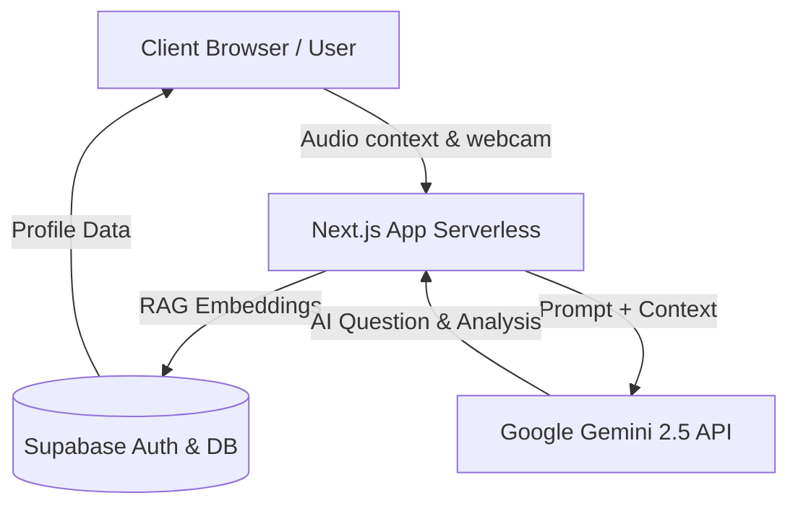
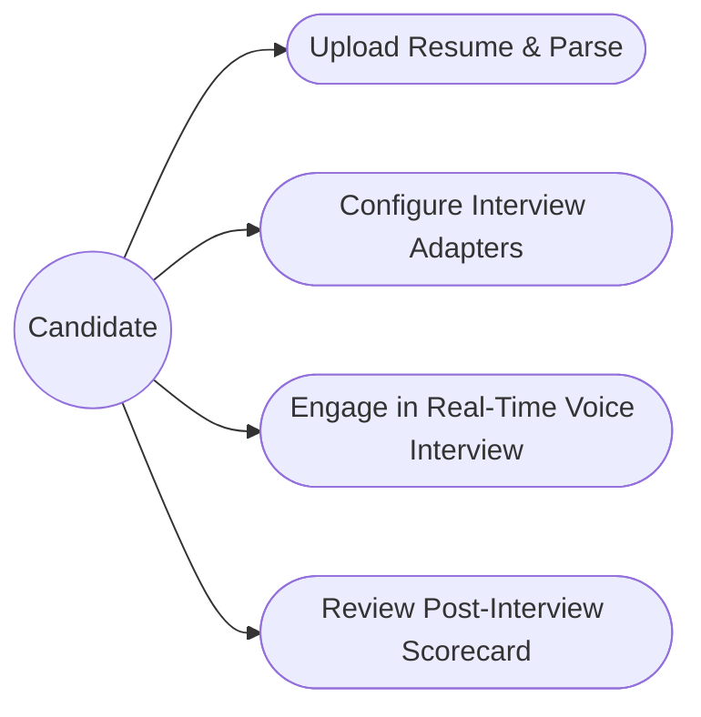
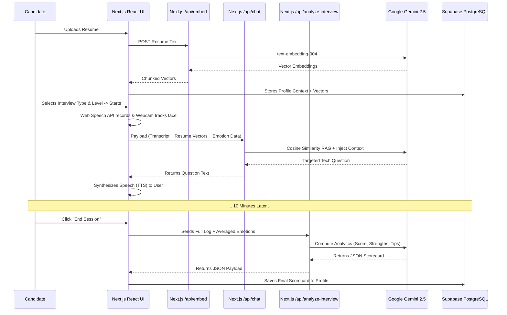

# 🏗️ Architecture Design

## Core Philosophy

The AI Interviewer platform is designed as a monolithic but highly-decoupled Next.js application, taking advantage of edge functions and serverless routing to easily scale. By placing complex logic in React Server Components and Next.js Route Handlers (API), we securely abstract the AI (Gemini) and Database (Supabase) connections away from the client browser.

## 1. High-Level Design (HLD)



## 2. Low-Level Design (LLD)

```mermaid
graph TD
    classDef frontend fill:#3b82f6,stroke:#1d4ed8,stroke-width:2px,color:#fff;
    classDef backend fill:#10b981,stroke:#047857,stroke-width:2px,color:#fff;

    page[<code>app/interview/page.tsx</code>]:::frontend
    webcam[<code>WebcamPreview.tsx</code> (face-api.js)]:::frontend
    apiChat[<code>/api/chat</code>]:::backend
    apiEmbed[<code>/api/embed</code>]:::backend
    apiAnalyze[<code>/api/analyze-interview</code>]:::backend

    page -->|Facial Tracking| webcam
    page -->|User Voice (SpeechRecognition)| apiChat
    apiChat -->|AI Context Vector Search| Supabase
    apiChat -->|TTS Response| page
    page -->|Resume File| apiEmbed
    page -->|End Session Stats| apiAnalyze
```

## 3. User & Use Case Flow



## 4. Sequence Diagram (Interview Loop)



## Folder Structure

| Path                         | Purpose                                                                        |
| :--------------------------- | :----------------------------------------------------------------------------- |
| `/app/api/chat`              | Serverless route bridging the frontend transcript and Vectors to Gemini.       |
| `/app/api/embed`             | Route converting PDF resumes into chunked contextual embeddings via Gemini.    |
| `/app/api/analyze-interview` | Serverless route for post-interview JSON extraction factoring facial analytics |
| `/app/interview/page.tsx`    | Core frontend hub orchestrating Web Speech, Webcams, TTS, and state.           |
| `/app/dashboard/page.tsx`    | Renders analytics fetched securely via Supabase Auth data.                     |
| `/components/WebcamPreview`  | Heavy-lifting component using face-api.js for tracking user expressions.       |
| `/lib/`                      | Utilities containing `resume-parser.ts` logic and Supabase client configs.     |

## Why this Architecture?

1. **Next.js & React Client-Side Fetching:** Leveraging raw `fetch` combined with Next.js App Router for server routes keeps the stack fully Typescript-typed from database to DOM.
2. **Supabase Client-Side Updates:** Because Next.js APIs run in serverless containers, injecting admin keys is risky. We adopted a model where the API handles the AI logic, but pushes the data back to the browser to let the native Supabase Web Client perform the insertion based on standard user session cookies.
3. **Local RAG & Embeddings:** By chunking and calculating Cosine Similarity locally in edge functions rather than hosting massive vector databases, we drastically keep operating costs to near zero while retaining deep contextual awareness.
4. **Browser-side Machine Learning:** Implementing `face-api.js` on the browser avoids sending excessive video packets to the server. The user's device calculates their own micro-expressions, sending only a lightweight JSON average to the server at the end of the session.
